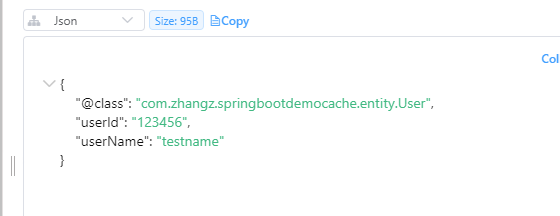
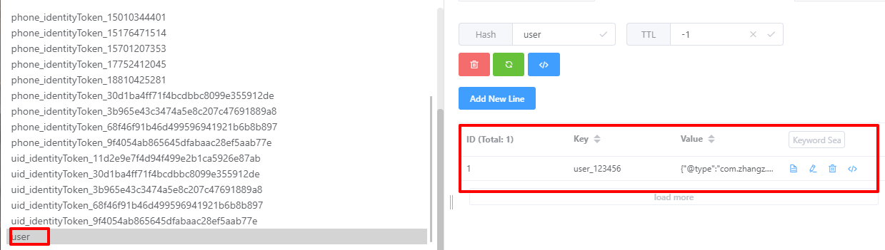

# cache
参考文档
>1. [springboot-cache缓存和J2cache二级缓存框架(带点漫画)](https://blog.csdn.net/qq_42745404/article/details/117376963)
>2. [j2cache与Spring-Cache集成以后缓存失效](https://www.wenjiangs.com/group/topic-469859.html)
>3. [原理详解](https://blog.csdn.net/weixin_36279318/article/details/82820880?ops_request_misc=%257B%2522request%255Fid%2522%253A%2522162229841316780274152971%2522%252C%2522scm%2522%253A%252220140713.130102334..%2522%257D&request_id=162229841316780274152971&biz_id=0&utm_medium=distribute.pc_search_result.none-task-blog-2~blog~sobaiduend~default-1-82820880.nonecase&utm_term=springboot+cache&spm=1018.2226.3001.4450)
## 1. spring-boot-cache
* 使用场景: 数据库请求压力大，将热数据缓存到redis，减轻数据库压力
### 1.1 引入依赖
```xml

        <dependency>
            <groupId>org.springframework.boot</groupId>
            <artifactId>spring-boot-starter-data-redis</artifactId>
        </dependency>
        <dependency>
            <groupId>org.springframework.boot</groupId>
            <artifactId>spring-boot-starter-web</artifactId>
        </dependency>
```
### 1.2 配置redis连接
```yml
spring:
  application:
#    name: agency-operation
  http:
    log-request-details: true
  redis:
    database: 0
    timeout: 2000
    host: 192.168.1.250
    port: 6379
    password: bosssoft
    jedis:
      pool:
        max-active: 20
        max-wait: 100
        max-idle: 20
        min-idle: 1

```
### 1.3 使用缓存
在需要使用缓存的地方增加注解
```java
  @Override
    @Cacheable(value = {"user"},key = "'user_' + #userId")
    public User getOneDemoUser(String userId) {
        User user = User.builder().userId("123456").userName("testname").build();
        return user;
    }
```
redis 中存储如下：  


### 1.4. Cacheable注解参数详解
#### 1.4.1. value 和 cacheNames
指定缓存名称  
@Cacheable 支持同一个方法关联多个缓存。这种情况下，当执行方法之前，这些关联的每一个缓存都会被检查，而且只要至少其中一个缓存命中了，那么这个缓存中的值就会被返回
>    @Cacheable({"menu", "menuById"})

### 1.4.2. key & keyGenerator
一个缓存名对应一个被注解的方法，但是一个方法可能传入不同的参数，那么结果也就会不同，这应该如何区分呢？这就需要用到 key 。在 spring 中，key 的生成有两种方式：显式指定和使用 keyGenerator 自动生成。

#### 1.4.2.1 KeyGenerator 自动生成
当我们在声明 @Cacheable 时不指定 key 参数，则该缓存名下的所有 key 会使用 KeyGenerator 根据参数 自动生成。spring 有一个默认的 SimpleKeyGenerator ，在 spring boot 自动化配置中，这个会被默认注入。生成规则如下：
>a. 如果该缓存方法没有参数，返回 SimpleKey.EMPTY ；

>b. 如果该缓存方法有一个参数，返回该参数的实例 ；

>c. 如果该缓存方法有多个参数，返回一个包含所有参数的 SimpleKey ；

默认的 key 生成器要求参数具有有效的 hashCode() 和 equals() 方法实现。另外，keyGenerator 也支持自定义， 并通过 keyGenerator 来指定。关于 KeyGenerator 这里不做详细介绍，有兴趣的话可以去看看源码，其实就是使用 hashCode 进行加乘运算。跟 String 和 ArrayList 的 hash 计算类似。

#### 1.4.2.2. 显式指定 key
相较于使用 KeyGenerator 生成，spring 官方更推荐显式指定 key 的方式，即指定 @Cacheable 的 key 参数。

即便是显式指定，但是 key 的值还是需要根据参数的不同来生成，那么如何实现动态拼接呢？SpEL（Spring Expression Language，Spring 表达式语言） 能做到这一点。下面是一些使用 SpEL 生成 key 的例子。
```java
    @Cacheable(value = {"menuById"}, key = "'hash' + #menu.hashCode()")
    public Menu findByHash(Menu menu) {
            return menu;
            }
```

### 1.4.3. cacheManager & cacheResolver
CacheManager，缓存管理器是用来管理（检索）一类缓存的。通常来讲，缓存管理器是与缓存组件类型相关联的。我们知道，spring 缓存抽象的目的是为使用不同缓存组件类型提供统一的访问接口，以向开发者屏蔽各种缓存组件的差异性。那么  CacheManager 就是承担了这种屏蔽的功能。spring 为其支持的每一种缓存的组件类型提供了一个默认的 manager，如：RedisCacheManager 管理 redis 相关的缓存的检索、EhCacheManager 管理 ehCache 相关的缓等。

CacheResolver，缓存解析器是用来管理缓存管理器的，CacheResolver 保持一个 cacheManager 的引用，并通过它来检索缓存。CacheResolver 与 CacheManager 的关系有点类似于 KeyGenerator 跟 key。spring 默认提供了一个 SimpleCacheResolver，开发者可以自定义并通过 @Bean 来注入自定义的解析器，以实现更灵活的检索。

大多数情况下，我们的系统只会配置一种缓存，所以我们并不需要显式指定 cacheManager 或者 cacheResolver。但是 spring 允许我们的系统同时配置多种缓存组件，这种情况下，我们需要指定。指定的方式是使用 @Cacheable 的 cacheManager 或者 cacheResolver 参数。

注意：按照官方文档，cacheManager 和 cacheResolver 是互斥参数，同时指定两个可能会导致异常。


### 1.4.4. sync
是否同步，true/false。在一个多线程的环境中，某些操作可能被相同的参数并发地调用，这样同一个 value 值可能被多次计算（或多次访问 db），这样就达不到缓存的目的。针对这些可能高并发的操作，我们可以使用 sync 参数来告诉底层的缓存提供者将缓存的入口锁住，这样就只能有一个线程计算操作的结果值，而其它线程需要等待，这样就避免了 n-1 次数据库访问。

sync = true 可以有效的避免缓存击穿的问题。(当缓存失效后，只有一个请求可以到达数据库，其他请求将阻塞)


### 1.4.5. condition
调用前判断，缓存的条件。有时候，我们可能并不想对一个方法的所有调用情况进行缓存，我们可能想要根据调用方法时候的某些参数值，来确定是否需要将结果进行缓存或者从缓存中取结果。比如当我根据年龄查询用户的时候，我只想要缓存年龄大于 35 的查询结果。那么 condition 能实现这种效果。

condition 接收一个结果为 true 或 false 的表达式，表达式同样支持 SpEL 。如果表达式结果为 true，则调用方法时会执行正常的缓存逻辑（查缓存-有就返回-没有就执行方法-方法返回不空就添加缓存）；否则，调用方法时就好像该方法没有声明缓存一样（即无论传入了什么参数或者缓存中有些什么值，都会执行方法，并且结果不放入缓存）。
```java
  @Cacheable(value = {"user"},key = "'user_' + #userId" ,condition = "#userId.equals('1234567')")
    public User getOneDemoUser(String userId) {
        User user = User.builder().userId("123456").userName("testname").build();
        return user;
    }
```
### 1.4.6 unless
    与condition不同，unless是在方法被调用后，对返回进行处理

## 2. J2Cache()
参考项目[spring-boot-j2-cache](https://gitee.com/null_751_0808/spring-boot-j2-cache/tree/master)
* 解决问题或者使用场景:

1. 系统业务增长，redis并发请求压力大，单纯的增加redis集群以及增加网络贷款，会造成资源的浪费，能省则省嘛
2. 引入本地换成，实现本地+redis的二级缓存模式
3. 本地一级缓存数据如何同步更新？故引入J2Cache，通过redis的消息订阅机制实现以及缓存的同步。
### 2.1 引入maven依赖
```xml
        <dependency>
    <groupId>net.oschina.j2cache</groupId>
    <artifactId>j2cache-spring-boot2-starter</artifactId>
    <version>2.7.6-release</version>
</dependency>

<dependency>
<groupId>net.oschina.j2cache</groupId>
<artifactId>j2cache-core</artifactId>
<version>2.8.2-release</version>
<exclusions>
    <exclusion>
        <groupId>org.slf4j</groupId>
        <artifactId>slf4j-simple</artifactId>
    </exclusion>
    <exclusion>
        <groupId>org.slf4j</groupId>
        <artifactId>slf4j-api</artifactId>
    </exclusion>
    <exclusion>
        <groupId>com.alibaba</groupId>
        <artifactId>fastjson</artifactId>
    </exclusion>
    <exclusion>
        <groupId>redis.clients</groupId>
        <artifactId>jedis</artifactId>
    </exclusion>
</exclusions>
</dependency>
<dependency>
    <groupId>redis.clients</groupId>
    <artifactId>jedis</artifactId>
    <version>2.9.1</version>
</dependency>
<dependency>
    <groupId>io.lettuce</groupId>
    <artifactId>lettuce-core</artifactId>
</dependency>
<dependency>
    <groupId>org.ehcache</groupId>
    <artifactId>ehcache</artifactId>
    <version>3.3.0</version>
</dependency>

```
### 2.2 增加配置文件
```yml
j2cache:
  config-location: /j2cache.properties
  redis-client: lettuce
  open-spring-cache: true

```


### 2.3 配置redis
```java
package com.zhangz.springbootdemocache.config;

import lombok.extern.slf4j.Slf4j;
import net.oschina.j2cache.CacheChannel;
import net.oschina.j2cache.J2CacheBuilder;
import net.oschina.j2cache.J2CacheConfig;
import org.springframework.beans.factory.annotation.Autowired;
import org.springframework.boot.autoconfigure.condition.ConditionalOnMissingBean;
import org.springframework.context.annotation.Bean;
import org.springframework.context.annotation.Configuration;
import org.springframework.core.env.Environment;
import org.springframework.data.redis.connection.RedisConnectionFactory;
import org.springframework.data.redis.core.RedisTemplate;
import org.springframework.data.redis.serializer.StringRedisSerializer;

import java.io.IOException;

@Slf4j
@Configuration
public class RedisConfig {

    @Autowired
    RedisConnectionFactory redisConnectionFactory;

    @Autowired
    Environment environment;

    @Bean(name = "redisTemplate")
    @ConditionalOnMissingBean(RedisTemplate.class)
    public RedisTemplate<String, Object> redisTemplate() {
        FastJsonRedisSerializer<Object> fastJsonRedisSerializer = new FastJsonRedisSerializer<>(Object.class);

        RedisTemplate<String, Object> redisTemplate = new RedisTemplate<>();
        redisTemplate.setKeySerializer(new StringRedisSerializer());
        redisTemplate.setHashKeySerializer(new StringRedisSerializer());
        redisTemplate.setValueSerializer(fastJsonRedisSerializer);
        redisTemplate.setHashValueSerializer(fastJsonRedisSerializer);
        redisTemplate.setConnectionFactory(redisConnectionFactory);

        return redisTemplate;
    }

    @Bean
    public CacheChannel channel() {
        CacheChannel channel = null;
        try {
            String configUrl = environment.resolvePlaceholders("${j2cache.config-location}");
            J2CacheConfig config = J2CacheConfig.initFromConfig(configUrl);
            J2CacheBuilder j2CacheBuilder = J2CacheBuilder.init(config);
            channel = j2CacheBuilder.getChannel();
            log.info("j2cache建立CacheChannel成功->" + "configUrl->" + configUrl + " 一级缓存->" + config.getL1CacheName() + " 二级缓存->" + config.getL2CacheName());
        } catch (IOException e) {
            log.error("j2cache建立CacheChannel报错->" + e);
        }

        return channel;
    }

}
```
### 2.4 简单使用
```java
    @Cacheable(value = {"user"}, key = "'user_' + #userId", condition = "#userId.equals('123456')")
    public User getOneDemoUser(String userId) {
        User user = User.builder().userId("123456").userName("testname").build();
        return user;
    }
```
以hash的形式存储   
