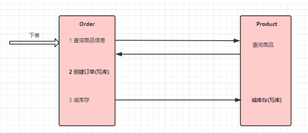

# spring cloud notes

参考文档:

1. [Spring Cloud Alibaba笔记@java1234.com](https://pan.baidu.com/s/1AVBNuU5crOOn9QM_Zy-nDg?pwd=1234)

## 1. 注册中心 配置中心 - cacos

> 参考链接：\
> [1.spring 整合nacos](https://blog.csdn.net/weixin_44033066/article/details/129043571?utm_medium=distribute.pc_relevant.none-task-blog-2\~default\~baidujs_baidulandingword\~default-0-129043571-blog-127871025.235^v38^pc_relevant_sort_base1\&spm=1001.2101.3001.4242.1\&utm_relevant_index=3)

### 1.1 nacos 安装 (linux)

安装位置 192.168.1.225 /opt/bssoft/nacos/nacos

> 参考文档:\
> [Nacos安装配置详细流程](https://blog.csdn.net/qq_52830988/article/details/128319218)

#### 1.1.1 下载nacos

* 选择与springboot 和 cloud
  对应的nacos [版本对照](https://github.com/alibaba/spring-cloud-alibaba/wiki/%E7%89%88%E6%9C%AC%E8%AF%B4%E6%98%8E)
  ;
* 下载选择 Assets 下的包
  

```shell
wget https://github.com/alibaba/nacos/releases/download/1.4.1/nacos-server-1.4.1.tar.gz
```

#### 1.1.2 解压

进入压缩包所在的文件夹:

```shell
[root@localhost ~]# cd /opt/bssoft/nacos
```

把文件解压到/opt/bssoft/nacos 目录下:

```shell
 tar -zxvf nacos-server-1.2.1.zip
 unzip nacos-server-1.2.1.zip
```

#### 1.1.3 启动

进入 bin目录

```shell
#非集群启动
./startup.sh -m standalone
```

#### 1.1.4 关闭

```shell
./shutdown.sh
```

#### 1.1.5 测试访问

默认用户名密码 nacos/nacos

```shell
http://192.168.1.225:8848/nacos
```

#### 1.1.6 设置开机自启

##### 1.1.6.1 创建 nacos.service文件

```shell
vim /lib/systemd/system/nacos.service

#内容如下
[Unit]
Description=nacos
After=network.target

[Service]
Type=forking
ExecStart=/usr/local/nacos/bin/startup.sh -m standalone
ExecReload=/usr/local/nacos/bin/shutdown.sh
ExecStop=/usr/local/nacos/bin/shutdown.sh
PrivateTmp=true

[Install]
WantedBy=multi-user.target

```

##### 1.1.6.2 修改nacos启动文件startup.sh

```shell
[ ! -e "$JAVA_HOME/bin/java" ] && JAVA_HOME=/usr/local/jdk1.8.0_191 
#[ ! -e "$JAVA_HOME/bin/java" ] && JAVA_HOME=/usr/java
#[ ! -e "$JAVA_HOME/bin/java" ] && JAVA_HOME=/opt/taobao/java
#[ ! -e "$JAVA_HOME/bin/java" ] && unset JAVA_HOME

```

##### 1.1.6.3 重启 使配置生效

```shell
systemctl daemon-reload        #重新加载服务配置
systemctl enable nacos.service #设置为开机启动
systemctl start nacos.service  #启动nacos服务
systemctl stop nacos.service   #停止nacos服务
systemctl status nacos.service   #查看nacos服务的状态

```

### 1.2. nacos 持久化

Nacos默认有自带嵌入式数据库derby，但是如果做集群模式的话，就不能使用自己的数据库不然每个节点一个数据库，那么数据就不统一了，需要使用外部的mysql

#### 1.2.1 配置nacos持久化

##### 1.2.1.1 修改 application.properties配置

增加支持mysql数据源配置（目前只支持mysql，版本要求：5.6.5+）; 文件位置： nacos/conf/application.properties

```yml
#*************** Config Module Related Configurations ***************#
### If user MySQL as datasource:
spring.datasource.platform=mysql

  ### Count of DB:

db.num=1
db.url.0=jdbc:mysql://192.168.1.188:3306/pc_coare0610ttt?characterEncoding=utf8&connectTimeout=1000&socketTimeout=3000&autoReconnect=true&useUnicode=true&useSSL=false&serverTimezone=UTC
  #db.url.1=jdbc:mysql://11.163.152.9:3306/nacos_devtest?characterEncoding=utf8&connectTimeout=1000&socketTimeout=3000&autoReconnect=true&useUnicode=true&useSSL=false&serverTimezone=UTC
db.user=root
db.password=root
```

##### 1.2.1.2 初始化nacos脚本

初始化nacos 脚本

```java
/nacos/conf 下的nacos-mysql.sql脚本
```

##### 1.2.1.2 重启nacos

我重启后之前配置的配置信息不见了？

```java
```

### 1.3. spring boot集成 nacos

#### 1.3.1 引入依赖

* 注意 springboot 、springcloud Alibaba 、以及nacos 对应的版本。

```xml

<parent>
    <groupId>org.springframework.boot</groupId>
    <artifactId>spring-boot-starter-parent</artifactId>
    <version>2.3.12.RELEASE</version>
    <relativePath/> <!-- lookup parent from repository -->
</parent>
```

```xml

<com.alibaba.cloud.alibaba.nacos>2.1.0.RELEASE</com.alibaba.cloud.alibaba.nacos>
<com.alibaba.cloud.alibaba.dependencies>2.2.9.RELEASE</com.alibaba.cloud.alibaba.dependencies>
```

```xml

<dependency>
    <groupId>com.alibaba.cloud</groupId>
    <artifactId>spring-cloud-alibaba-dependencies</artifactId>
    <version>${com.alibaba.cloud.alibaba.dependencies}</version>
    <type>pom</type>
    <scope>import</scope>
</dependency>

        <!-- 注册中心 -->
<dependency>
<groupId>com.alibaba.cloud</groupId>
<artifactId>spring-cloud-starter-alibaba-nacos-discovery</artifactId>
<version>${com.alibaba.cloud.alibaba.nacos}</version>
</dependency>
        <!-- 配置中心 -->
<dependency>
<groupId>com.alibaba.cloud</groupId>
<artifactId>spring-cloud-starter-alibaba-nacos-config</artifactId>
<version>${com.alibaba.cloud.alibaba.nacos}</version>
</dependency>
```

#### 1.3.2 修改配置以及启动类

启动类增加注解：

```java
@EnableDiscoveryClient // 开启nacos
```

配置文件名称改为 bootstrap.yaml,配置如下

```yaml
server:
  port: 8888
  servlet:
    context-path: /configManager
  compression:
    enabled: true
    mime-types: application/json
    min-response-size: 2048

spring:
  application:
    name: configManager
  cloud:
    nacos:
      discovery:
        server-addr: 192.168.1.225:8848
      config:
        server-addr: 192.168.1.225:8848
        #指定分组 根据项目分组
        group: DEFAULT_GROUP
        #指定文件名，没有则默认${spring.application.name}
        #指定读取配置中心文件后缀
        file-extension: yaml
  profiles:
    active: dev
```

#### 1.3.3 在nacos 配置 配置文件

在配置列表，点击“新增”

> Data ID = spring.application.name + '-' + spring.profiles.active + '.' + spring.cloud.nacos.config.file-extension\
> Group = spring.cloud.nacos.config.group\
> 增加配置信息\
> 点击发布，则会同步配置到项目，可通过日志查看是否生效

#### 1.3.4 共享配置

```text
    服务名.yaml 将 系统同一配置写在里面 
```

#### 1.3.5 配置优先级


### 1.4. nacos 控制台的基本使用

[Nacos--详解以及使用（全网最全）](https://blog.csdn.net/maoheguxiang/article/details/129718265)

### 1.5. nacos 用法 example

[Nacos--详解以及使用（全网最全）](https://blog.csdn.net/maoheguxiang/article/details/129718265)

#### 1.5.1 热配置 用例

##### 1.5.1.1 @value 注解

在使用@Value注入值的类上增加注解@RefreshScope

```java
@RefreshScope

@Value("${system.test.shardvalue}")
private String shardvalue;
```

##### 1.5.5.1.2 @ConfigurationProperties 注解

```java

@Component
@Data
@ConfigurationProperties(prefix = "system.test")
public class SystemTestProperties {
    private String shardvalue;
}
```

#### 1.5.2 共享配置

    生成一个 applicant.yaml 的文件 ，在nacos 新增对应的配置

#### 1.5.3 注册中心

##### 1.5.3.1 在配置文件中配置nacos为配置中心

```yaml
spring:
  application:
    name: spring-boot-demo-nacos-provider
  cloud:
    nacos:
      discovery:
        server-addr: 192.168.1.225:8848
        # 集群
#        cluster-name: test
#        namespace: configManager
```

##### 1.5.3.2 dubbo 注册中心配置为 nacos

```yaml
dubbo:
  application:
    name: spring-boot-demo-nacos-provider
  #  scan:
  #    base-packages: com.zhangz.springbootdemonacosprovider.service.impl
  protocols:
    dubbo:
      name: dubbo
      port: 20881
  registry:
    address: nacos://${spring.cloud.nacos.discovery.server-addr}
    group: nacosDemo
```

##### 1.5.3.3 启动类

```java
@EnableDiscoveryClient // 开启nacos
@EnableDubbo 
```

##### 1.5.3.4 提供者

```java
// 在service上增加注解
@DubboService
```

##### 1.5.3.5 消费者

```java
// 使用 @DubboReference 注解
@DubboReference
private TestService testService;
```

## 2. Fegin 远程调用

### 2.1 简介

> Feign是Spring Cloud提供的一个声明式的伪Http客户端， 它使得调用远程服务就像调用本地服务 一样简单， 只需要创建一个接口并添加一个注解即可。 Nacos很好的兼容了Feign， Feign默认集成了 Ribbon， 所以在Nacos下使用Fegin默认就实现了负 载均衡的效果。

### 引入maven依赖

```xml
<!--fegin组件-->
<dependency>
    <groupId>org.springframework.cloud</groupId>
    <artifactId>spring-cloud-starter-openfeign</artifactId>
</dependency>
```

### 2.2 开启feign

```java
//启动类增加注解
@EnableFeignClients 
```

### 2.3 demo 实例

1.编写接口

```java
   @GetMapping("/getProductByName")
@ResponseBody
public String getProductByName(@RequestParam("productName") String productName){
        log.info("getProductByName params  productName:{}",productName);
        List<Product> productList=productService.getProductByName(productName);
        return JSON.toJSONString(productList);
        }
```

2.在调用的服务增加feign接口

```java

@RefreshScope
@FeignClient(name = "cloud-alibaba-product", url = "${cloudAlibaba.service.product.address}")
public interface FeignProductService {
    // 指定调用提供者的哪个方法
    // @FeignClient+@GetMapping 就是一个完整的请求路径 http://localhost:8888/cloud-alibaba-product/getProductByName
    @GetMapping("/product/getProductByName")
    String getProductByName(@RequestParam("productName") String productName);
}
```

1. 增加配置文件 这里我增加到了 all-server.yaml 文件中，每个服务的地址应该都是一样的，可以共用

```yaml
cloudAlibaba:
  allServer:
    publicConfig: 12423423234234
  service:
    product:
      address: localhost:8888/cloud-alibaba-product
```

### 2.4 其他

#### 2.4.1 fegin调用为什么要使用@RequestParam
参考文档：
1. https://blog.csdn.net/qq_43386944/article/details/130722525?utm_medium=distribute.pc_relevant.none-task-blog-2~default~baidujs_baidulandingword~default-12-130722525-blog-130359398.235^v38^pc_relevant_sort_base1&spm=1001.2101.3001.4242.7&utm_relevant_index=15
> fegin 默认使用的是spring的编码器来序列化参数，spring的编码器需指明参数名称才能正确的
> 进行序列化。

## 3. Sentinel--服务容错

### 3.1 常见的容错策略

1. 隔离
2. 超时
3. 限流
4. 熔断
5. 降级

### 3.2 常见的容错组件

1. Hystrix
2. Resilience4J
3. Sentnel

### 3.3 集成sentinel

1. 在maven 加入依赖

```xml

<!--熔断 sentinel -->
<dependency>
    <groupId>com.alibaba.cloud</groupId>
    <artifactId>spring-cloud-starter-alibaba-sentinel</artifactId>
    <version>2.2.4.RELEASE</version>
</dependency>
<dependency>
<groupId>org.springframework.boot</groupId>
<artifactId>spring-boot-starter-actuator</artifactId>
<version>2.2.5.RELEASE</version>
</dependency>

```

1. 修改配置文件

```yaml
spring:
  application:
    name: cloud-alibaba-order
  cloud:
    sentinel:
      transport:
        port: 8179 # 同控制台交互的地址
        dashboard: 127.0.0.1:8080 # 控制台地址
      eager: true
```

### 3.3 模拟限流 熔断

1. 启动 sentinel 客户端

> 项目地址： sentinel-dashboard-zk
> 访问地址： <http://localhost:8080/#/dashboard/degrade/sentinel-dashboard>  sentinel\sentinel

1. 模拟限流

> 4.1 登录到sentinel控制台\
> 4.2 在簇点链路中选择需要限流的接口\
> 4.3 点击流控 ，增加限流规则\
> 4.4 可通过 jmeter 模拟并发请求，同时查看后台访问日志 (可限制并发数为1 ，这样能够明显看到日志减少)
> 也可以同时swagger请求同一接口，返回 （Blocked by Sentinel (flow limiting)）

### 3.4 feign 整合 sentinel

1. 增加依赖

```xml
<!--sentinel客户端-->
<dependency>
    <groupId>com.alibaba.cloud</groupId>
    <artifactId>spring-cloud-starter-alibaba-sentinel</artifactId>
</dependency>
```

1. 在配置文件中开启feign对sentinel的支持

```yaml
feign:
  sentinel:
    enabled: true
```

1. 创建feign service接口的容错实现类

```java
/**
 * @author 100451
 *  熔断接口实现 
 *  1.容错类 必须实现需要容错的所有接口 ， 并且实现容错方案
 */
@Component
@Slf4j
public class FeignProductServiceFallBack implements FeignProductService {
    @Override
    public String getProductByName(String productName) {
        log.warn("proudct server method getProductByName fallback ,params proudctName :{} ", productName);
        Product fallback = Product.builder().pid("-1").pname("fallback").build();
        return JSON.toJSONString(fallback);
    }

    @Override
    public String getProductById(String pid) {
        log.warn("proudct server method getProductById fallback ,params pid :{} ", pid);
        Product fallback = Product.builder().pid("-1").pname("fallback").build();
        return JSON.toJSONString(fallback);
    }
}
```

1. feign 调用service接口上指定容错类

```java
/**
 *  fallback 指定容错类
 */
@RefreshScope
@FeignClient(name = "cloud-alibaba-product", url = "${cloudAlibaba.service.product.address}", fallback = FeignProductServiceFallBack.class)
public interface FeignProductService {
    // 指定调用提供者的哪个方法
    // @FeignClient+@GetMapping 就是一个完整的请求路径 http://localhost:8888/cloud-alibaba-product/getProductByName
    @GetMapping("/product/getProductByName")
    String getProductByName(@RequestParam("productName") String productName);

    @GetMapping("/product/getProductById")
    String getProductById(@RequestParam("pid") String pid);
}
```

## 4. gateway

### 4.1 引入maven依赖

* 需注意删除spring-boot-start-web相关依赖

```xml

<dependency>
    <groupId>org.springframework.cloud</groupId>
    <artifactId>spring-cloud-starter-gateway</artifactId>
</dependency>
```

* 引入nacos 配置中心

```xml
 <!-- 注册中心 -->
<dependency>
    <groupId>com.alibaba.cloud</groupId>
    <artifactId>spring-cloud-starter-alibaba-nacos-discovery</artifactId>
</dependency>

        <!-- 配置中心 -->
<dependency>
<groupId>com.alibaba.cloud</groupId>
<artifactId>spring-cloud-starter-alibaba-nacos-config</artifactId>
</dependency>
<dependency>
<groupId>org.springframework.cloud</groupId>
<artifactId>spring-cloud-starter-loadbalancer</artifactId>
</dependency>

```

### 4.2. 启动类增加 注解

```java
@EnableDiscoveryClient
```

### 4.3 编写配置文件

```yaml
spring:
  application:
    name: cloud-alibaba-gateway
  cloud:
    gateway:
      filter:
        remove-hop-by-hop:
          headers:
            # 以下是去掉网关默认去掉的请求响应头
            - trailer
            - te
            - keep-alive
            - transfer-encoding
            - upgrade
            - proxy-authenticate
            - connection
            - proxy-authorization
            - x-application-context
            # 以下是去掉服务层面定义的跨域
            - access-control-allow-credentials
            - access-control-allow-headers
            - access-control-allow-methods
            - access-control-allow-origin
            - access-control-max-age
            - vary
      globalcors:
        corsConfigurations:
          '[/**]':
            allowCredentials: true
            allowedOrigins: "*"
            allowedHeaders: "*"
            allowedMethods: "*"
            maxAge: 3628800
      discovery:
        locator:
          enabled: true # 让gateway 可以发现nacos中的微服务
      routes:
        - id: test
          uri: https://www.baidu.com
          order: 1
          predicates:
            - Path=/test/**
          filters:
            - StripPrefix=1

        - id: cloud_product
          # 要转发到的地址 lb是指从nacos中安装名称获取微服务并且遵循负载均衡
          uri: lb://cloud-alibaba-product
          order: 1
          predicates:
            # 当请求路径满足断言时才进行转发 
            - Path=/product/**
          filters:
            # 转发之前去掉一层路径
            - StripPrefix=1
    nacos:
      discovery:
        server-addr: 192.168.1.225:8848
        # 集群
      #        cluster-name: test
      #        namespace: configManager
      config:
        server-addr: 192.168.1.225:8848
        # 指定分组 根据项目分组
        #        group: provider
        # 指定文件名，没有则默认${spring.application.name}
        # 指定读取配置中心文件后缀
        file-extension: yaml
        shared-dataids: all-server.yaml # 配置要引入的配置
        refreshable-dataids: all-server.yaml # 配置需要动态刷新的配置

  profiles:
    active: dev

#暴露端点
management:
  endpoints:
    web:
      exposure:
        include: '*'

```

> * StripPrefix=1\
    >     例如：（<http://127.0.0.1:8181/product/list> -> <http://192.168.1.100:8086/list），>

### 4.4. 测试调用

```text
http://localhost:7777/test/
 
http://localhost:7777/product/cloud-alibaba-product/product/getProductById?pid=123123
```

### 4.5. 网关限流

> 从1.6.0版本开始，Sentinel提供了SpringCloud Gateway的适配模块，可以提供两种资源维度的限流：
> \* route维度：即在Spring配置文件中配置的路由条目，资源名为对应的routeId
> \* 自定义API维度：用户可以利用Sentinel提供的API来自定义一些API分组

#### 4.5.1 引入依赖

```xml

<dependency>
    <groupId>com.alibaba.csp</groupId>
    <artifactId>sentinel-spring-cloud-gateway-adapter</artifactId>
</dependency>
```

#### 4.5.2 编写限流配置类

> 基于Sentinel 的Gateway限流是通过其提供的Filter来完成的，使用时只需注入对应的 SentinelGatewayFilter实例以及 SentinelGatewayBlockExceptionHandler 实例即可。

```java
package com.zhangz.springbootdemocloudalibabagateway.config;

import com.alibaba.csp.sentinel.adapter.gateway.common.SentinelGatewayConstants;
import com.alibaba.csp.sentinel.adapter.gateway.common.api.ApiDefinition;
import com.alibaba.csp.sentinel.adapter.gateway.common.api.ApiPathPredicateItem;
import com.alibaba.csp.sentinel.adapter.gateway.common.api.ApiPredicateItem;
import com.alibaba.csp.sentinel.adapter.gateway.common.api.GatewayApiDefinitionManager;
import com.alibaba.csp.sentinel.adapter.gateway.common.rule.GatewayFlowRule;
import com.alibaba.csp.sentinel.adapter.gateway.common.rule.GatewayRuleManager;
import com.alibaba.csp.sentinel.adapter.gateway.sc.SentinelGatewayFilter;
import com.alibaba.csp.sentinel.adapter.gateway.sc.callback.BlockRequestHandler;
import com.alibaba.csp.sentinel.adapter.gateway.sc.callback.GatewayCallbackManager;
import com.alibaba.csp.sentinel.adapter.gateway.sc.exception.SentinelGatewayBlockExceptionHandler;
import org.springframework.beans.factory.ObjectProvider;
import org.springframework.cloud.gateway.filter.GlobalFilter;
import org.springframework.context.annotation.Bean;
import org.springframework.context.annotation.Configuration;
import org.springframework.core.Ordered;
import org.springframework.core.annotation.Order;
import org.springframework.http.HttpStatus;
import org.springframework.http.MediaType;
import org.springframework.http.codec.ServerCodecConfigurer;
import org.springframework.web.reactive.function.BodyInserters;
import org.springframework.web.reactive.function.server.ServerResponse;
import org.springframework.web.reactive.result.view.ViewResolver;
import org.springframework.web.server.ServerWebExchange;
import reactor.core.publisher.Mono;

import javax.annotation.PostConstruct;
import java.util.*;

/**
 * @author 100451
 */
@Configuration
public class GatewayConfiguration {
    private final List<ViewResolver> viewResolvers;
    private final ServerCodecConfigurer serverCodecConfigurer;

    public GatewayConfiguration(ObjectProvider<List<ViewResolver>> viewResolversProvider, ServerCodecConfigurer serverCodecConfigurer) {
        this.viewResolvers = viewResolversProvider.getIfAvailable(Collections::emptyList);
        this.serverCodecConfigurer = serverCodecConfigurer;
    }

    /**
     * 初始化一个限流的过滤器
     * @return
     */
    @Bean
    @Order(Ordered.HIGHEST_PRECEDENCE)
    public GlobalFilter sentinelGatewayFilter() {
        return new SentinelGatewayFilter();
    }

    /**
     * 配置初始化的限流参数
     */
    @PostConstruct
    public void initGatewayRules() {
        Set<GatewayFlowRule> rules = new HashSet<>();
        // 以路由id为单元
        rules.add(new GatewayFlowRule("cloud_product") // 资源名称,对应路由id
                .setCount(1) // 限流阈值
                .setIntervalSec(1) // 统计时间窗口，单位是秒，默认是 1 秒
        );
        // 以自定义api路径为单元
        rules.add(new GatewayFlowRule("product_api1").setCount(1).setIntervalSec(1));
        rules.add(new GatewayFlowRule("product_api2").setCount(1).setIntervalSec(1));
        GatewayRuleManager.loadRules(rules);
    }

    // 配置限流的异常处理器
    @Bean
    @Order(Ordered.HIGHEST_PRECEDENCE)
    public SentinelGatewayBlockExceptionHandler sentinelGatewayBlockExceptionHandler() {
        return new SentinelGatewayBlockExceptionHandler(viewResolvers, serverCodecConfigurer);
    }

    /**
     * 自定义限流异常页面
     */
    @PostConstruct
    public void initBlockHandlers() {
        BlockRequestHandler blockRequestHandler = new BlockRequestHandler() {
            @Override
            public Mono<ServerResponse> handleRequest(ServerWebExchange serverWebExchange, Throwable throwable) {
                Map map = new HashMap<>();
                map.put("code", 0);
                map.put("message", "接口被限流了");
                return ServerResponse.status(HttpStatus.OK).contentType(MediaType.APPLICATION_JSON_UTF8).body(BodyInserters.fromObject(map));
            }
        };
        GatewayCallbackManager.setBlockHandler(blockRequestHandler);
    }

    // *************** 自定义 api 分组

    // 自定义API分组
    @PostConstruct
    private void initCustomizedApis() {
        Set<ApiDefinition> definitions = new HashSet<>();
        ApiDefinition api1 = new ApiDefinition("product_api1").setPredicateItems(new HashSet<ApiPredicateItem>() {
            {
                // 以/product-serv/product/api1 开头的请求
                add(new ApiPathPredicateItem().setPattern("/product-serv/product/api1/**").setMatchStrategy(SentinelGatewayConstants.URL_MATCH_STRATEGY_PREFIX));
            }
        });
        ApiDefinition api2 = new ApiDefinition("product_api2").setPredicateItems(new HashSet<ApiPredicateItem>() {
            {
                // 以/product-serv/product/api2/demo1 完成的url路径匹配
                add(new ApiPathPredicateItem().setPattern("/product-serv/product/api2/demo1"));
            }
        });
        definitions.add(api1);
        definitions.add(api2);
        GatewayApiDefinitionManager.loadApiDefinitions(definitions);
    }

    // TODO 是否可以通过接口动态的管理限流
}

```

#### 4.5.3 测试限流效果\\

> 快速调用 <http://localhost:7777/cloud-alibaba-product/product/getProductById?pid=123123>
> 返回信息 {"code":0,"message":"接口被限流了"}

## 5. 链路追踪 Sleuth +Zinkin

参考文档：

* [spring cloud 调用链追踪：集成 Sleuth 和 Zipkin，实现链路打标](https://blog.csdn.net/sumguo10qq/article/details/129207291)

### 5.1集成 sleuth

1. 引入maven依赖

```xml
  <!--链路追踪 Sleuth-->
<dependency>
    <groupId>org.springframework.cloud</groupId>
    <artifactId>spring-cloud-starter-sleuth</artifactId>
</dependency>
```

1. 增加配置文件

```yaml
spring:
  # 链路监控
  sleuth:
    log:
      slf4j:
        enabled: true
    sampler:
      # 采样率的概率， 100%采样
      probability: 1.0
      # 每秒采样数字最高为1000
      rate: 1000

```

1. 启动项目 调用请求

* 查看控制台日志

> 2023-11-16 11:20:51.183  INFO \[cloud-alibaba-order,b6e2419f74aaa0e3,b6e2419f74aaa0e3,true] 40236 --- \[nio-9999-exec-1] c.z.s.controller.OrderController         : getOrderById params  orderId\:u5etr\
> 2023-11-16 11:20:51.183  INFO \[serverId,traceId,spanId,true]

### 5.2 整合zipkin

#### 5.2.1  zipkin 服务端安装启动

1.下载zipkin-server

> 下载地址\
> <https://search.maven.org/remote_content?g=io.zipkin&a=zipkin-server&c=exec&v=2.23.9>

2.命令行启动 zipkin-server\
zipkin-server 内置了rabbitMQ 默认的RavvitMQ 的账号密码都是guset/guest 队列是 zipkin，\
可通过下列参数 修改 :


```shell
# 连接 RabbitmQ 
java -jar zipkin-server-2.23.9-exec.jar --zipkin.collector.rabbitmq.addresses=localhost:5672
# 单独启动
java -jar zipkin-server-2.23.9-exec.jar
# 后台启动 
nohup java -jar zipkin.jar >zipkin_logs & 
# 查看zipkin输出日志
tail zipkin_logs         
# 查看zipkin进程 ）
ps -ef | gerp zipkin      
#杀死zipkin进程 
kill -9 29170 
 
```

1. 浏览器访问控制台

```text
http://localhost:9411
```

#### 5.2.2 zipkin 客户端集成

1.引入maven依赖

```xml

<dependency>
    <groupId>org.springframework.cloud</groupId>
    <artifactId>spring-cloud-starter-zipkin</artifactId>
</dependency>
```

1. 增加配置

```yaml
spring:
  zipkin:
    base-url: http://localhost:9411/ #zipkin server的请求地址
    discovery-client-enabled: false # 让nacos把她当作一个url而不是服务名
```

1. 重启项目 调用接口 查看控制台
   

### 5.2.3  zipkin 数据持久化\\

    参考文档：
    *   [JavaEdge Docker搭建Zipkin，实现数据持久化到MySQL、ES](https://zhuanlan.zhihu.com/p/652677976)
    > zipkin-server 数据默认保存在内存中的，最大存储为50000个span.\
    > zipkin 天然支持cassandra elasticsearch 以及 MySQL三种持久化方式。\
    > [zipkin 配置](https://github.com/openzipkin/zipkin/blob/master/zipkin-server/src/main/resources/zipkin-server-shared.yml)\
    > [持久化版本对照](https://link.zhihu.com/?target=https%3A//github.com/openzipkin/zipkin%25EF%25BC%258C%25E5%258F%25AF%25E6%259F%25A5%25E7%259C%258B%25EF%25BC%259A)

#### 5.2.3.1  mysql 持久化

1. 新建数据 zipkin 并且初始化建表脚本

> [MySQL建表语句参考](https://link.zhihu.com/?target=https%3A//github.com/openzipkin/zipkin/blob/master/zipkin-storage/mysql-v1/src/main/resources/mysql.sql)

1. 修改启动命令 增加MySQL 信息

```shell
docker run \
--name zipkin-server -d \
--restart=always \
-p 9411:9411 \
-e MYSQL_USER=root \
-e MYSQL_PASS=lhzlx \
-e MYSQL_HOST=111.229.160.175 \
-e STORAGE_TYPE=mysql \
-e MYSQL_DB=zipkin \
-e MYSQL_TCP_PORT=3316 \
openzipkin/zipkin:2.21.7
```

1. 启动项目并且调用后查看数据库进行验证

##### 5.2.3.2  es 持久化

1. 无需建表 只需启动时指定es配置

```shell
  java -DSTORAGE_TYPE=elasticsearch -DES_HOSTS=http://192.168.2.14:9200 -jar  zipkin-server-2.23.9-exec.jar > publish.log &
```

1. 重启zipkin-server 后调用服务 查询es

```shell
GET zipkin-span-2023-11-16/_search
```

## 6. 消息驱动 - rabbitMQ

参考文档：

* [秃秃头头\:SpringCloud项目整合RabbitMQ](https://blog.csdn.net/weixin_43028393/article/details/129818186)
* [codeLearn\:Spring Cloud 集成 RabbitMQ ](https://www.cnblogs.com/codeLearn/p/16964708.html)

### 6.1 应用场景

* 异步接口
* 流量消峰

### 6.2 引入maven依赖

```xml

<dependency>
    <groupId>org.springframework.cloud</groupId>
    <artifactId>spring-cloud-stream-binder-rabbit</artifactId>
</dependency>
<dependency>
<groupId>org.springframework.cloud</groupId>
<artifactId>spring-cloud-starter-stream-rabbit</artifactId>
</dependency>

```

### 6.3 增加配置信息

```yaml
spring:
  rabbitmq:
    host: 192.168.1.166
    port: 5672
    username: guest
    password: guest
```

1. 发送消息

```java

@Autowired
private RabbitTemplate rabbitTemplate;


        // 订单生成以后 发送消息通知用户 已下单
        rabbitTemplate.convertAndSend(MQConfig.ORDER_RUTEKEY,"订单【"+orderId+"】已下单！");

```

### 6.4 简单使用

1. 接收消息

```java

@Slf4j
@Component
public class MqReceiveService {

    /**
     * 接收订单下单后 发送用户通知的消息
     * 当队列不存在时自动创建并且自动绑定exchange
     * @param message 消息体
     */
    @RabbitListener(bindings = {@QueueBinding(value = @Queue(MQConfig.ORDER_QUEUE), exchange = @Exchange(MQConfig.ORDER_EXCHANGE), key = MQConfig.ORDER_RUTEKEY)})
    public void orderNotion(String message) {
        log.info("接收到消息体|{}", message);
    }
}
```

## 7. SMS - 短信服务

> 这里选择了阿里云哈，腾讯云的签名不好申请，阿里还给3个月100条免费短信的体验，直接就够用了。

> 短信服务使用流程： 1.创建并且登录腾讯、阿里云；2.开通短信服务；3.申请签名；4.申请短信模版；

腾讯云入口： <https://console.cloud.tencent.com/developer>\
微信公众号入口： <https://mp.weixin.qq.com/cgi-bin/home>

参考文档：

> * <https://blog.csdn.net/xiangyangsanren/article/details/134119525>

阿里云短信发送demo：

> <https://next.api.aliyun.com/api-tools/demo/Dysmsapi/db7e1211-14e0-4b7b-9011-037dfb85d42e>

* 测试用例： 创建订单 ： 创建订单后，通过MQ异步发送下单成功通知，通知方式短信（阿里）

## 8. 分布式事务 - seata

### 8.1. 分布式事务解决方案

#### 8.1.1 全局事务

> 二阶段提交，1.表决阶段 2 执行阶段；\
> 阶段一: 表决阶段，所有参与者都将本事务执行预提交，并将能否成功的信息反馈发给协调者。
>
> 阶段二: 执行阶段，协调者根据所有参与者的反馈，通知所有参与者，步调一致地执行提交或者回 滚。1 优点：

* 提高了数据一致性的概率，实现成本低

缺点：

* 单点问题： 书记舞协调组宕机
* 同步阻塞：延迟了提交时间，加成了资源阻塞时间
* 数据不一致：提交第二节点，依然存在commit结果的未知。

#### 8.1.1.2 可靠消息服务

> 基于可靠消息服务的方案是通过消息中间件保证上、下游应用数据操作的一致性。假设有A和B两个 系统，分别可以处理任务A和任务B。此时存在一个业务流程，需要将任务A和任务B在同一个事务中处 理。就可以使用消息中间件来实现这种分布式事务。
> 
> 过程：\
> 第一步: 消息由系统A投递到中间件

1. 在系统A处理任务A前，首先向消息中间件发送一条消息
2. 消息中间件收到后将该条消息持久化，但并不投递。持久化成功后，向A回复一个确认应答
3. 系统A收到确认应答后，则可以开始处理任务A
4. 任务A处理完成后，向消息中间件发送Commit或者Rollback请求。该请求发送完成后，对系统A而 言，该事务的处理过程就结束了
5. 如果消息中间件收到Commit，则向B系统投递消息；如果收到Rollback，则直接丢弃消息。但是 如果消息中间件收不到Commit和Rollback指令，那么就要依靠"超时询问机制"。 超时询问机制
   系统A除了实现正常的业务流程外，还需提供一个事务询问的接口，供消息中间件调 用。当消息中间件收到发布消息便开始计时，如果到了超时没收到确认指令，就会主动调用
   系统A提供的事务询问接口询问该系统目前的状态。该接口会返回三种结果，中间件根据三 种结果做出不同反应： 提交:将该消息投递给系统B 回滚:直接将条消息丢弃 处理中:继续等待

第二步: 消息由中间件投递到系统B

消息中间件向下游系统投递完消息后便进入阻塞等待状态，下游系统便立即进行任务的处理，任务 处理完成后便向消息中间件返回应答。

* 如果消息中间件收到确认应答后便认为该事务处理完毕
* 如果消息中间件在等待确认应答超时之后就会重新投递，直到下游消费者返回消费成功响应为止。 一般消息中间件可以设置消息重试的次数和时间间隔，如果最终还是不能成功投递，则需要手工干
  预。这里之所以使用人工干预，而不是使用让Ａ系统回滚，主要是考虑到整个系统设计的复杂度问 题。

基于可靠消息服务的分布式事务，前半部分使用异步，注重性能；后半部分使用同步，注重开发成本。

#### 8.1.1.3 最大努力通知

#### 8.1.1.4 TCC事务

### 8.2  seata 介绍

#### 8.2.1 seata主要组件

* TC : Transaction Ccoordinator : 事务协调器，管理全局的分支事务的状态，用于全局性事务的提交 和回滚
* TM\:Transaction Managet: 事务管理器 用于开启，回滚，提交事务
* RM: Resource manager 资源管理器，用于分支事务上的资源管理，向TC注册分支事务，商保分支事务的状态，接受TC的命令来提交或者回滚分支事务。
  

Seata的执行流程如下:

> 1. A服务的TM向TC申请开启一个全局事务，TC就会创建一个全局事务并返回一个唯一的XID
> 2. A服务的RM向TC注册分支事务，并及其纳入XID对应全局事务的管辖
> 3. A服务执行分支事务，向数据库做操作
> 4. A服务开始远程调用B服务，此时XID会在微服务的调用链上传播
> 5. B服务的RM向TC注册分支事务，并将其纳入XID对应的全局事务的管辖
> 6. B服务执行分支事务，向数据库做操作
> 7. 全局事务调用链处理完毕，TM根据有无异常向TC发起全局事务的提交或者回滚
> 8. TC协调其管辖之下的所有分支事务， 决定是否回滚

#### 8.2.2 Seata实现2PC与传统2PC的差别

1. 架构层次方面，传统2PC方案的 RM 实际上是在数据库层，RM本质上就是数据库自身，通过XA协 议实现，而 Seata的RM是以jar包的形式作为中间件层部署在应用程序这一侧的。
2. 两阶段提交方面，传统2PC无论第二阶段的决议是commit还是rollback，事务性资源的锁都要保 持到Phase2完成才释放。而Seata的做法是在Phase1 就将本地事务提交，这样就可以省去Phase2
   持锁的时间，整体提高效率

### 8.3 seata 的简单使用

* 参考文档：

1. https://blog.csdn.net/weixin_43904285/article/details/132038938

### 8.3.1 案例介绍



### 8.3.2 编写场景代码

1.order 服务

```java
 @Override
public Order createOrder(String pid,int number)throws Exception{
        String orderId=UUIDUtils.getUUID32();

        // Product productById = productRPCService.getProductById(pid);
        // log.info("dubbo 查询商品服务返回商品信息|{}", productById);

        String productStr=feignProductService.getProductById(pid);
        log.info("查询商品服务返回商品信息|{}",productStr);
        Product product=JSON.parseObject(productStr,Product.class);

        if("-1".equals(product.getPid())){
        return Order.builder().oid(orderId).pid("-1").pname("熔断啦").build();
        }

        Order build=Order.builder().oid(orderId).pid(pid).pname(product.getPname()).pprice(new BigDecimal("12.7")).number(number).uid("1111111").username("1111111").build();
        orderMapper.insert(build);
        log.info("生成订单信息|{}",JSON.toJSONString(build));

        // 扣减库存
        feignProductService.reduceInventory(pid,number);

        // 订单生成以后 发送消息通知用户 已下单
        rabbitTemplate.convertAndSend(MQConfig.ORDER_EXCHANGE,MQConfig.ORDER_RUTEKEY,"订单【"+orderId+"】已下单！");
        return build;
        }
```

2. 商品服务

```java
 @Override
public void reduceInventory(String pid,int num)throws Exception{

        // 查询库存
        Product product=productMapper.selectById(pid);
        if(null==product){
        throw new Exception("商品【"+pid+"】不存在");
        }

        if(product.getStock()<num){
        log.error("商【{}】,库存不足。库存数量：{},需扣减数量:{}",pid,product.getStock(),num);
        throw new Exception("库存不足");
        }

        // 减少库存
        Integer oldSock=product.getStock();
        Integer newStock=product.getStock()-num;
        product.setStock(newStock);
        productMapper.updateById(product);

        log.info("商品【{}】的库存数量为:{} = {} - {}",product.getPid(),newStock,oldSock,num);

        }
```

### 8.3.3 模拟异常请求

```text
调用创建订单的请求，当数量大于库存时，商品服务异常但是订单以及创建入库
```

### 8.3.4 seate 安装以及启动

#### 8.3.4.1 seate 下载

* 下载地址：https://github.com/seata/seata/releases/download/v1.6.1/seata-server-1.6.1.zip

#### 8.3.4.2 seate 修改配置

1. apoplication.yml

```yaml
server:
  port: 7091
spring:
  application:
    name: seata-server
logging:
  config: classpath:logback-spring.xml
  file:
    path: ../runninglogs/logs/seata
  extend:
    logstash-appender:
      destination: 127.0.0.1:4560
    kafka-appender:
      bootstrap-servers: 127.0.0.1:9092
      topic: logback_to_logstash
console:
  user:
    username: seata
    password: seata
seata:
  config:
    # support: nacos, consul, apollo, zk, etcd3
    type: nacos
    nacos:
      server-addr: 192.168.1.225:8848
      group: DEFAULT_GROUP
      data-id: seataServerConfig.yml
  registry:
    # support: nacos, eureka, redis, zk, consul, etcd3, sofa
    type: nacos
    nacos:
      application: seata-server
      group: DEFAULT_GROUP
      server-addr: 192.168.1.225:8848
  store:
    # support: file 、 db 、 redis
    mode: db
    db:
      datasource: druid
      db-type: mysql
      driver-class-name: com.mysql.jdbc.Driver
      url: jdbc:mysql://192.168.1.188:3306/zz_test?rewriteBatchedStatements=true
      user: root
      password: root
      min-conn: 10
      max-conn: 100
      global-table: global_table
      branch-table: branch_table
      lock-table: lock_table
      distributed-lock-table: distributed_lock
      query-limit: 1000
      max-wait: 5000
  #  server:
  #    service-port: 8091 #If not configured, the default is '${server.port} + 1000'
  # 将安全认证进行去除，因为可能会导致一定的问题
  security:
    secretKey: SeataSecretKey0c382ef121d778043159209298fd40bf3850a017
    tokenValidityInMilliseconds: 1800000
    ignore:
      urls: /,/**/*.css,/**/*.js,/**/*.html,/**/*.map,/**/*.svg,/**/*.png,/**/*.ico,/console-fe/public/**,/api/v1/auth/login
```

2. seata-server.bat 增加 pause ，就直接可以双击启动啦

```bat
pause
``` 

#### 8.3.4.3 seate 配置数据库

1. 修改applicant.yml

```yaml
  store:
    # support: file 、 db 、 redis
    mode: db
    db:
      datasource: druid
      db-type: mysql
      driver-class-name: com.mysql.jdbc.Driver
      url: jdbc:mysql://192.168.1.188:3306/zz_test?rewriteBatchedStatements=true
      user: root
      password: root
      min-conn: 10
      max-conn: 100
      global-table: global_table
      branch-table: branch_table
      lock-table: lock_table
      distributed-lock-table: distributed_lock
      query-limit: 1000
      max-wait: 5000
```

2. 初始化脚本

> 脚本位置 ： seata\script\server\db

#### 启动 seata

> 双击 seata-server.bat
> 查看nacos 服务列表是否有seata-server 的服务

### 8.3.5 使用 seata 实现分布式事务

#### 8.3.5.1 引入 maven依赖

```xml
    <!--seata相关的配置-->
<dependency>
    <groupId>com.alibaba.cloud</groupId>
    <artifactId>spring-cloud-starter-alibaba-seata</artifactId>
    <version>2022.0.0.0-RC2</version>
</dependency>

```

#### 8.3.5.2 配置seata

1. bootstrap.yaml

```yaml
seata:
  #  spring.datasource.dynami.seata 需要同时开启
  enabled: true
  # 关闭自动代理
  enable-auto-data-source-proxy: false
  # 事务群组（可以每个应用独立取名，也可以使用相同的名字）
  tx-service-group: cloud_alibaba_group
  service:
    vgroup-mapping:
      cloud_alibaba_group: default
  registry:
    type: nacos
    nacos:
      server-addr: 192.168.1.225:8848
      application: seata-server
      group: DEFAULT_GROUP
```

#### 8.3.5.3 修改数据源代理为seata

> 配置数据源 为 com.alibaba.druid.pool.DruidDataSource，否则 事务会不生效

```java
package com.zhangz.springbootdemocloudalibabaproduct.config;

import com.alibaba.druid.pool.DruidDataSource;
import io.seata.rm.datasource.DataSourceProxy;
import org.springframework.boot.context.properties.ConfigurationProperties;
import org.springframework.context.annotation.Bean;
import org.springframework.context.annotation.Configuration;
import org.springframework.context.annotation.Primary;

@Configuration
public class DataSourceProxyConfig {
    @Bean
    @ConfigurationProperties(prefix = "spring.datasource")
    public DruidDataSource druidDataSource() {
        return new DruidDataSource();
    }

    @Primary
    @Bean
    public DataSourceProxy dataSource(DruidDataSource druidDataSource) {
        return new DataSourceProxy(druidDataSource);
    }
}
```

#### 8.3.5.4 解决fegin调用不生效问题

> 在fegin header 中加入TX_XID，否则fegin 调用的事务会不生效

```java
package com.zhangz.springbootdemocloudalibabaproduct.config;

import javax.servlet.http.HttpServletRequest;

import io.seata.core.context.RootContext;
import org.springframework.context.annotation.Configuration;
import org.springframework.http.HttpHeaders;
import org.springframework.web.context.request.RequestContextHolder;
import org.springframework.web.context.request.ServletRequestAttributes;
import feign.RequestInterceptor;
import feign.RequestTemplate;

@Configuration
public class FeignConfig implements RequestInterceptor {

    @Override
    public void apply(RequestTemplate requestTemplate) {
        ServletRequestAttributes attributes = (ServletRequestAttributes) RequestContextHolder.getRequestAttributes();
        HttpServletRequest request = attributes.getRequest();
        requestTemplate.header(HttpHeaders.AUTHORIZATION, request.getHeader(HttpHeaders.AUTHORIZATION));
        //seata分布式事务
        requestTemplate.header(RootContext.KEY_XID, RootContext.getXID());
    }

}

```

#### 8.3.5.5 引入注解 @GlobalTransactional

> 在需要分布式事务的地方引入 下列注解

```java
  @GlobalTransactional(name = "cloud_alibaba_group", rollbackFor = Exception.class) 
```

#### 8.3.5.6 启动项目进行测试

> 调用创建订单接口，数量要大于库存数量。 会看到订单表并未增加数据。

## 9. rpc通信 Dubbo

### 9.1 引入maven依赖

```xml
     <!--dubbo-->
<dependency>
    <groupId>com.alibaba.cloud</groupId>
    <artifactId>spring-cloud-starter-dubbo</artifactId>
    <version>2.2.7.RELEASE</version>
</dependency>
```

### 9.2 修改 配置

```yaml
#provider
dubbo:
  scan:
    base-packages: com.zhangz
  protocol:
    name: dubbo # 协议
    port: -1 #  -1 表示端口自增 从20880开始
  registry:
    address: spring-cloud://localhost # 注册中心

# customer
dubbo:
  protocol:
    port: -1
    name: dubbo
  registry:
    address: spring-cloud://localhost #注册中心
  #  cloud:
  #    subscribed-services: *
  consumer:
    check: false
  scan:
    base-packages: com.zhangz
```

### 9.3 修改启动类

```java
@DubboComponentScan
```

### 9.4 简单使用

```java
// 提供者
// 2.7.8  后的版本与@Service注解区分 改为@DubboService
@DubboService(interfaceClass = ProductRpcService.class)
@Slf4j
public class ProductRpcServiceImpl implements ProductRpcService {

    @Resource
    private ProductService productService;

    @Override
    public List<Product> getProductByName(String productName) {
        log.info("进入 PRC 调用 getProductByName ");

        return productService.getProductByName(productName);
    }

    @Override
    public Product getProductById(String pid) {
        log.info("进入 PRC 调用 getProductById ");

        return productService.getProductById(pid);
    }
}
```

```java
//消费者
// 通过@DubboReference 注解注入dubbo接口
@DubboReference
private ProductRpcService productRPCService;
```

